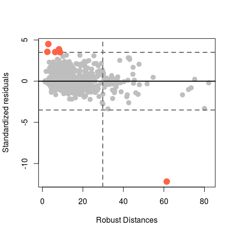
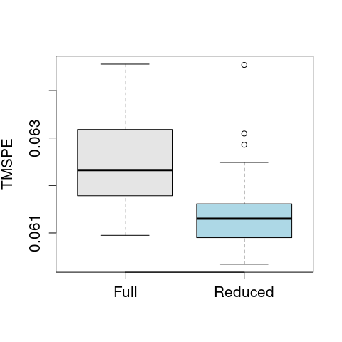

Robust tests for linear regression models based on tau-estimates
================
Matias Salibian
2017-03-13

Robust tests based on tau-estimates
-----------------------------------

This page contains R code implementing robust tests for linear regression models based on tau-estimates as proposed in Salibian-Barrera, M., Van Aelst, S. and Yohai, V.J., (2016) Robust tests for linear regression models based on tau-estimates, Computational Statistics and Data Analysis, 93, 436-455. A preprint is available [here](https://www.stat.ubc.ca/~matias/tau-tests-rev1.pdf), the paper is available [here](http://dx.doi.org/10.1016/j.csda.2014.09.012).

Below we reproduce the example discussed in the paper.

First load the required libraries and the tau-tests code available here in the file `tautests.R`:

``` r
library(languageR)
library(robustbase)
source('tautests.R')
```

We will use a subset of a dataset available in the `languageR` package. More information can be obtained with `help(selfPacedReadingHeid)`.

``` r
data(selfPacedReadingHeid)
x <- selfPacedReadingHeid
x2 <- subset(x, subset = (Condition == "baseheid"))
```

We now build the design matrix for the full model and compute a tau regression estimator in order to verify whether there may be any outliers in the data:

``` r
xa <- model.matrix(RT ~ RT4WordsBack + RT3WordsBack + RT1WordBack + RTtoPrime + 
    RT2WordsLater + LengthInLetters + RT2WordsBack + FamilySize + RT1WordLater + 
    Rating + NumberOfSynsets + BaseFrequency + RootFrequency, data = x2)
a <- fasttau_Opt(x = xa, y = x2$RT)
```

We now build a robust-leverage vs residuals plot, and indicate potential outliers in red:

``` r
# Compute robust leverage measures (Mahalanobis distances computed in the
# design space)
library(rrcov)
b2 <- 0.1278
y <- x2$RT
res <- as.vector(y - xa %*% a$beta)/(a$tauscale/sqrt(b2))
x.cov <- CovMMest(x = xa[, -1])
mu <- getCenter(x.cov)
x.cov <- getCov(x.cov)
x.ma <- mahalanobis(x = xa[, -1], center = mu, cov = x.cov)
plot(res ~ x.ma, pch = 19, col = "gray", cex = 1.3, ylab = "Standardized residuals", 
    xlab = "Robust Distances")
# +/- 3.5 standard deviations
abline(h = 3.5, lwd = 2, col = "gray40", lty = 2)
abline(h = -3.5, lwd = 2, col = "gray40", lty = 2)
abline(h = 0, lwd = 2)
# Cut-off points for high-leverage points
abline(v = qchisq(0.995, df = 13), lwd = 2, lty = 2, col = "gray40")
# Highlight outliers
oo <- (abs(res) > 3.5)
points(res ~ x.ma, pch = 19, col = "tomato", cex = 1.7, subset = oo)
```



<!-- n <- nrow(x2) -->
The estimated p-values for the individual tests of significance for each regression parameter using the asymptotic normal approximation for the distribution of the tau-estimator gives

``` r
uu <- abs(a$beta/sqrt(diag(a$cov)))
round(2 * (1 - pt(uu, df = nrow(xa) - ncol(xa))), 3)
```

    ##                  [,1]
    ## (Intercept)     0.000
    ## RT4WordsBack    0.000
    ## RT3WordsBack    0.000
    ## RT1WordBack     0.000
    ## RTtoPrime       0.000
    ## RT2WordsLater   0.000
    ## LengthInLetters 0.014
    ## RT2WordsBack    0.045
    ## FamilySize      0.223
    ## RT1WordLater    0.394
    ## Rating          0.842
    ## NumberOfSynsets 0.188
    ## BaseFrequency   0.619
    ## RootFrequency   0.860

The corresponding p-values computed with the Fast and Robust Bootstrap (see [here](http://here)) are:

``` r
b2 <- 0.1278
fi <- as.vector(xa %*% a$beta)
rr <- y - fi
tmp2 <- tautestRBPairs(x = xa, fi = fi, rr = rr, beta = a$beta, sigma = a$scale, 
    R = 1000)$betastR
a$cov <- var(tmp2)
uu <- abs(a$beta/sqrt(diag(a$cov)))
round(2 * (1 - pt(uu, df = nrow(xa) - ncol(xa))), 3)
```

    ##                  [,1]
    ## (Intercept)     0.000
    ## RT4WordsBack    0.002
    ## RT3WordsBack    0.000
    ## RT1WordBack     0.000
    ## RTtoPrime       0.012
    ## RT2WordsLater   0.004
    ## LengthInLetters 0.040
    ## RT2WordsBack    0.240
    ## FamilySize      0.171
    ## RT1WordLater    0.470
    ## Rating          0.896
    ## NumberOfSynsets 0.354
    ## BaseFrequency   0.714
    ## RootFrequency   0.849

We now test simultaneously whether the submodel resulting of retaining only the variables with significant individual tests is sufficient (in other words, the restricted model contains only explanatory variables with p-values &gt; 0.05)

``` r
xa <- model.matrix(RT ~ RT4WordsBack + RT3WordsBack + RT1WordBack + RTtoPrime + 
    RT2WordsLater + LengthInLetters + RT2WordsBack + FamilySize + RT1WordLater + 
    Rating + NumberOfSynsets + BaseFrequency + RootFrequency, data = x2)

x0 <- model.matrix(RT ~ RT4WordsBack + RT3WordsBack + RT1WordBack + RTtoPrime + 
    RT2WordsLater + LengthInLetters, data = x2)

y <- x2$RT

# Compute the FRB p-values

set.seed(123)
tau.t <- tautest(x0 = x0, xa = xa, y = y, R = 1000, Nsamp = 2500)
round(unlist(tau.t), 4)
```

    ##         tauHa         tauH0     ratiotest    Sratiotest      ASconstS 
    ##        0.3168        0.3193        0.0156        0.0315        0.4530 
    ##  Sratiopvalue      SscaleH0      SscaleHa         Wtest         Stest 
    ##        0.2288        0.2535        0.2496        8.0959       42.3713 
    ##       Wpvalue       Spvalue   ratiopvalue       ASconst       LRTtest 
    ##        0.3242        0.0000        0.2212        0.9264        9.5117 
    ##     LRTpvalue  ratioBpvalue      WBpvalue      SBpvalue    LRTBpvalue 
    ##        0.2180        0.3154        0.4072        0.2545        0.2645 
    ## SratioBpvalue 
    ##        0.1028

The labels for the above p-values are as follows: \* XXXtest: is the corresponding value of the test statistic; \* XXXpvalue: is the p-value estimated with the asymptotic approximation \* XXXBpvalue: is the p-value estimated with the FRB

Note that the bootstrap p-values are systematically larger than those based on the asymptotic distribution, which suggests that there is not enough evidence to reject the smaller model. In fact, we show below that the smaller model gives better robust predictions.

Prediction powers via 5-fold CV for different trimming values
=============================================================

We will use 10 runs of 5-fold CV to compare the predictions obtained with the full and the reduced models. To avoid penalizing poor predictions for the outlying observations, instead of using the usual mean squared residual error, for each sample we compute the 10% \`\`upper-trimmed mean squared error'' which is the mean of the 90% smallest residuals (in absolute value).

``` r
# trimmed MSE function
# returns the average of the (1-alpha)100%
# smallest elements in "x", each of them squared
tm <- function(x, alpha) {
  n <- length(x)
  n0 <- floor(alpha * n)
  n <- n - n0
  return( mean( (sort(x^2))[1:n] ) )
}


n <- dim(x2)[1]
# Number of 5-fold CV runs
N <- 10
mse.r1 <- mse.r2 <- rep(0, N) 
set.seed(123)
# 5-fold CV
k <- 5
ii <- (1:n) %% k + 1 
for(i in 1:N) {
  ii <- sample(ii)
  pr.r1 <- pr.r2 <- rep(0, n)
  for(j in 1:5) {
    # fit full model
    a <- fasttau_Opt(x=xa[ii!=j,], y = y[ii!=j])
    # fit reduced model
    b <- fasttau_Opt(x=x0[ii!=j,], y = y[ii!=j])
    # predictions (full and reduced models)
    pr.r1[ii==j] <- as.vector(xa[ii==j,] %*% a$beta)
    pr.r2[ii==j] <- as.vector(x0[ii==j,] %*% b$beta)
  }
  # 10% trimmed mean squared prediction error
  mse.r1[i] <- tm( (y - pr.r1), alpha=0.10) # alp.tr[j] ) 
  mse.r2[i] <- tm( (y - pr.r2), alpha=0.10) # alp.tr[j] ) 
}
boxplot(mse.r1, mse.r2, col=c('gray90', 'lightblue'),
        # main=paste('Trimming: ', alp.tr[j], sep=''),
        names = c('Full', 'Reduced'), ylab='TMSPE', cex.axis=1.3, cex.lab=1.3)
```



<!-- The next plot shows the results of 100 runs -->
<!-- of 5-fold CV, which confirm these results: -->
<!-- ```{R preds2, fig.height=7, fig.width=7, tidy=TRUE, warning=FALSE, message=FALSE, cache=TRUE, echo=FALSE} -->
<!-- n <- dim(x2)[1] -->
<!-- # Number of 5-fold CV runs -->
<!-- N <- 100 -->
<!-- mse.r1 <- mse.r2 <- rep(0, N)  -->
<!-- set.seed(123) -->
<!-- # 5-fold CV -->
<!-- k <- 5 -->
<!-- ii <- (1:n) %% k + 1  -->
<!-- for(i in 1:N) { -->
<!--   ii <- sample(ii) -->
<!--   pr.r1 <- pr.r2 <- rep(0, n) -->
<!--   for(j in 1:5) { -->
<!--     # fit full model -->
<!--     a <- fasttau_Opt(x=xa[ii!=j,], y = y[ii!=j]) -->
<!--     # fit reduced model -->
<!--     b <- fasttau_Opt(x=x0[ii!=j,], y = y[ii!=j]) -->
<!--     # predictions (full and reduced models) -->
<!--     pr.r1[ii==j] <- as.vector(xa[ii==j,] %*% a$beta) -->
<!--     pr.r2[ii==j] <- as.vector(x0[ii==j,] %*% b$beta) -->
<!--   } -->
<!--   # 10% trimmed mean squared prediction error -->
<!--   mse.r1[i] <- tm( (y - pr.r1), alpha=0.10) # alp.tr[j] )  -->
<!--   mse.r2[i] <- tm( (y - pr.r2), alpha=0.10) # alp.tr[j] )  -->
<!-- } -->
<!-- boxplot(mse.r1, mse.r2, col=c('gray90', 'lightblue'), -->
<!--         # main=paste('Trimming: ', alp.tr[j], sep=''), -->
<!--         names = c('Full', 'Reduced'), ylab='TMSPE', cex.axis=1.3, cex.lab=1.3) -->
<!-- ``` -->
